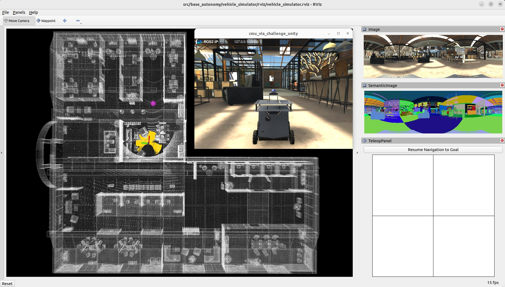

# Vector Robotics Ground Autonomy Stack

This repository provides a **generalizable autonomy stack for ground robots**. The stack is designed to be **embodiment-agnostic** (wheeled, legged, etc.) by selecting a robot configuration via `ROBOT_CONFIG_PATH`.

It includes:

- **SLAM** (mapping + localization)
- **Base autonomy** (terrain analysis, collision avoidance, waypoint following)
- **Route planning**:
  - **FAR Planner** (default, visibility graph based planner)
  - **PCT Planner** (optional; efficient global navigation in multi-layer 3D structures)
- **Exploration planning** (TARE Planner)

For the ROS API (topics/services), see `AUTONOMY_STACK_README.md`.

## Supported Environment

- Ubuntu 24.04
- ROS 2 Jazzy

## Quick Start

### 1) Install ROS + system dependencies

After installing ROS 2 Jazzy, source it in your shell:

```bash
echo "source /opt/ros/jazzy/setup.bash" >> ~/.bashrc
source ~/.bashrc
```

Install core dependencies:

```bash
sudo apt update
sudo apt install -y \
  ros-jazzy-desktop-full \
  ros-jazzy-pcl-ros \
  libpcl-dev \
  git
```

#### Additional native dependencies (MID360 + SLAM builds)

If you are building the MID360 driver and SLAM from source (real robot setup), install the additional C++ toolchain + math/logging deps:

```bash
sudo apt update
sudo apt install -y \
  cmake \
  libgoogle-glog-dev \
  libgflags-dev \
  libatlas-base-dev \
  libeigen3-dev \
  libsuitesparse-dev
```

#### Build Livox-SDK2 (required for `livox_ros_driver2`)

Livox-SDK2 is vendored under this repo at `src/utilities/livox_ros_driver2/Livox-SDK2`:

```bash
cd src/utilities/livox_ros_driver2/Livox-SDK2
mkdir -p build && cd build
cmake ..
make -j"$(nproc)"
sudo make install
```

Then build the ROS 2 driver package:

```bash
cd ~/autonomy_stack_mecanum_wheel_platform
colcon build --symlink-install --cmake-args -DCMAKE_BUILD_TYPE=Release --packages-select livox_ros_driver2
```

#### Build SLAM dependencies (Sophus / Ceres / GTSAM)

These dependencies are vendored under `src/slam/dependency/`. If you don’t already have them installed system-wide, you can install them from source:

```bash
# Sophus
cd src/slam/dependency/Sophus
mkdir -p build && cd build
cmake .. -DBUILD_TESTS=OFF
make -j"$(nproc)"
sudo make install
```

```bash
# Ceres Solver
cd src/slam/dependency/ceres-solver
mkdir -p build && cd build
cmake ..
make -j"$(nproc)"
sudo make install
```

```bash
# GTSAM
cd src/slam/dependency/gtsam
mkdir -p build && cd build
cmake .. -DGTSAM_USE_SYSTEM_EIGEN=ON -DGTSAM_BUILD_WITH_MARCH_NATIVE=OFF
make -j"$(nproc)"
sudo make install
sudo /sbin/ldconfig
```

Then build the SLAM packages:

```bash
cd ~/autonomy_stack_mecanum_wheel_platform
colcon build --symlink-install --cmake-args -DCMAKE_BUILD_TYPE=Release --packages-select arise_slam_mid360 arise_slam_mid360_msgs
```

### 2) Build

From the repository root:

```bash
colcon build --symlink-install --cmake-args -DCMAKE_BUILD_TYPE=Release
```

Simulation-only build (skips SLAM + MID360 driver):

```bash
colcon build --symlink-install --cmake-args -DCMAKE_BUILD_TYPE=Release \
  --packages-skip arise_slam_mid360 arise_slam_mid360_msgs livox_ros_driver2
```

### 3) Configure environment variables (robot + optional localization map)

#### Robot configuration

`ROBOT_CONFIG_PATH` selects the robot-specific YAML under `src/base_autonomy/local_planner/config/`.

Examples:

```bash
# Wheeled example
export ROBOT_CONFIG_PATH="mechanum_drive"

# Legged examples (see src/base_autonomy/local_planner/config/unitree/)
export ROBOT_CONFIG_PATH="unitree/unitree_g1"
# export ROBOT_CONFIG_PATH="unitree/unitree_go2"
# export ROBOT_CONFIG_PATH="unitree/unitree_go2_fast"
# export ROBOT_CONFIG_PATH="unitree/unitree_go2_stairs"
# export ROBOT_CONFIG_PATH="unitree/unitree_b1"
```

#### Map configuration (localization mode) 🚧 Under development


The stack uses `MAP_PATH` to switch from SLAM/mapping mode to localization mode.

- `MAP_PATH` is a **file prefix** (no extension)
- SLAM loads: `"$MAP_PATH.pcd"` (or `.txt` legacy)
- PCT planner loads: `"$MAP_PATH_tomogram.pickle"`

Recommended map layout:

```text
/home/user/maps/warehouse/
├── map.pcd
└── map_tomogram.pickle
```

Set `MAP_PATH` to the **prefix** (`.../map`):

```bash
export MAP_PATH="/home/user/maps/warehouse/map"
```

To generate the tomogram from a PCD (requires PCT planner dependencies; see `src/route_planner/PCT_planner/README.md`):

```bash
source install/setup.bash
ros2 run pct_planner pcd_to_tomogram.py /home/user/maps/warehouse/map.pcd -o /home/user/maps/warehouse/map_tomogram.pickle
```

## Run

### Simulation

#### Unity environment model

The stack supports Unity-based simulation environments. Download a Unity environment model and unzip to:

`src/base_autonomy/vehicle_simulator/mesh/unity/`

Unity model download: `https://drive.google.com/drive/folders/1G1JYkccvoSlxyySuTlPfvmrWoJUO8oSs?usp=sharing`

#### Base autonomy (simulation)

```bash
./system_simulation.sh
```

#### With route planner (simulation)

```bash
./system_simulation_with_route_planner.sh
```

To use **PCT planner** instead of FAR planner, run directly via launch and set `use_pct_planner:=true`:

```bash
source install/setup.bash
ros2 launch vehicle_simulator system_simulation_with_route_planner.launch use_pct_planner:=true
```

#### With exploration planner (simulation)

```bash
./system_simulation_with_exploration_planner.sh
```

### Real robot

#### 1) Add user to `dialout`

```bash
sudo adduser "$USER" dialout
sudo reboot now
```

#### 2) MID360 Ethernet configuration (recommended)

Set the MID360 Ethernet interface IPv4 to:

- Address: `192.168.1.5`
- Netmask: `255.255.255.0`
- Gateway: `192.168.1.1`

Then configure the MID360 IP inside:

`src/utilities/livox_ros_driver2/config/MID360_config.json`

`"ip": "192.168.1.1xx"` where `xx` are the last two digits of the serial number.

Verify:

```bash
ping 192.168.1.1xx
```

More detailed setup notes: `DIMOS_SETUP.md`.

#### 3) Launch

Base autonomy + SLAM:

```bash
./system_real_robot.sh
```

With route planner (Choose this by default):

```bash
./system_real_robot_with_route_planner.sh
```

With exploration planner:

```bash
./system_real_robot_with_exploration_planner.sh
```

To use **PCT planner** instead of FAR planner:

```bash
source install/setup.bash
ros2 launch vehicle_simulator system_real_robot_with_route_planner.launch use_pct_planner:=true
```


## Operating modes (RViz + joystick)

<p align="center">
  <br>
  <em>Base autonomy (smart joystick, waypoint, and manual modes)</em>
</p>

- **Smart joystick mode (default)**: robot follows joystick intent but still avoids obstacles.
  - Use the RViz teleop panel or the controller sticks to command motion.
  - If the system is in another mode, commanding motion will switch back to smart joystick mode.
- **Waypoint mode**: robot follows waypoints and still avoids obstacles.
  - Use RViz “Waypoint” to set a nearby waypoint around the robot.
  - Route/exploration planners also drive the base autonomy in waypoint mode.
  - If using the route planner / exploration planner UI, click **Resume Navigation to Goal** to resume waypoint-mode navigation.
- **Manual mode (no obstacle checking)**: robot follows joystick commands without collision avoidance.
  - This is intended for careful operator control only.

Example waypoint sender:

```bash
source install/setup.bash
ros2 launch waypoint_example waypoint_example.launch
```

## Controller mapping (Xbox / PS controllers)

This stack consumes `/joy` directly. The current code expects these indices:

- **Manual drive**:
  - Forward/back: `axes[4]`
  - Left/right strafe: `axes[3]`
  - Yaw: `axes[0]` (Mode 2 convention)
- **Hold-to-enable autonomy / obstacle checking**:
  - Autonomy enable: `axes[2]` (pressed -> value < -0.1)
  - Obstacle checking enable: `axes[5]` (released -> value > -0.1; pressed disables obstacle checking)
- **Clear terrain map button**: `buttons[5]`

For most Xbox controllers on Linux (`xpad`), `buttons[5]` is **RB**. For PS controllers it may map differently.

If the mapping is off on your machine, verify indices by watching `/joy` while pressing controls:

```bash
source install/setup.bash
ros2 topic echo /joy
```

## Bagfile workflow

Record (on robot, while running):

```bash
source install/setup.bash
ros2 bag record /imu/data /lidar/scan -o 'bagfolder_path'
```

Run the stack on a bag:

```bash
./system_bagfile.sh
./system_bagfile_with_route_planner.sh
./system_bagfile_with_exploration_planner.sh
```

Play the bag (in a separate terminal):

```bash
source install/setup.bash
ros2 bag play 'bagfolder_path/bagfile_name.mcap'
```

Example bags: `https://drive.google.com/drive/folders/1G1JYkccvoSlxyySuTlPfvmrWoJUO8oSs?usp=sharing`

## Notes / Troubleshooting

- RViz on Wayland can be problematic on Jazzy. If needed, switch to X11.
- If Unity bridge fails at startup, retry the launch (ROS-TCP-Endpoint can be flaky).
- If joystick isn’t recognized, replug the USB dongle.
- Wheel type changes: update `config:=omniDir` vs `config:=standard` in local planner launch.
- If SLAM drifts or the robot starts behaving strangely, **clear the terrain map** and retry:
  - Press the controller button mapped to `joy.buttons[5]` (often **RB** on Xbox).
  - Or publish to `/map_clearing` (clears around the robot by distance):

```bash
source install/setup.bash
ros2 topic pub /map_clearing std_msgs/msg/Float32 "data: 8.0" --once
```

## Credits / References

Development of the autonomy stack is led by [Ji Zhang's](https://frc.ri.cmu.edu/~zhangji) group at Carnegie Mellon University. 

Alex Lin (Dimensional) has contributed to the productionization and later development of the stack.

Relevant projects:

- SLAM: upgraded implementation of [LOAM](https://github.com/cuitaixiang/LOAM_NOTED)
- Base autonomy: inspired by [Autonomous Exploration Development Environment](https://www.cmu-exploration.com)
- FAR Planner: `https://github.com/MichaelFYang/far_planner`
- PCT Planner paper & demos: `https://byangw.github.io/projects/tmech2024/`
