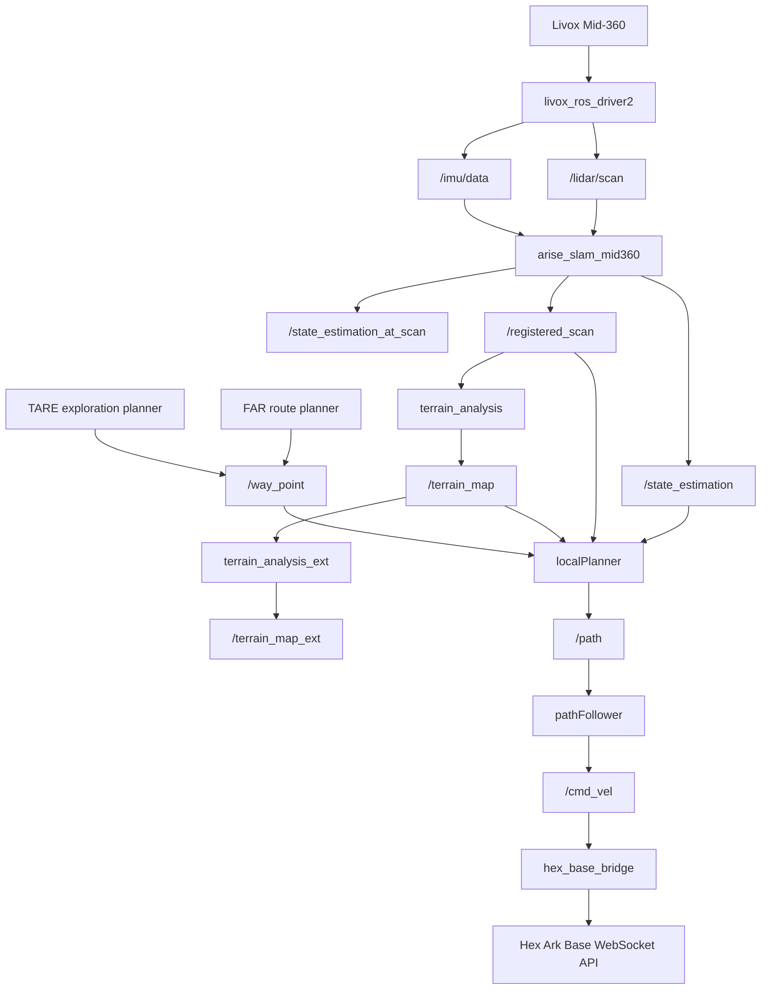
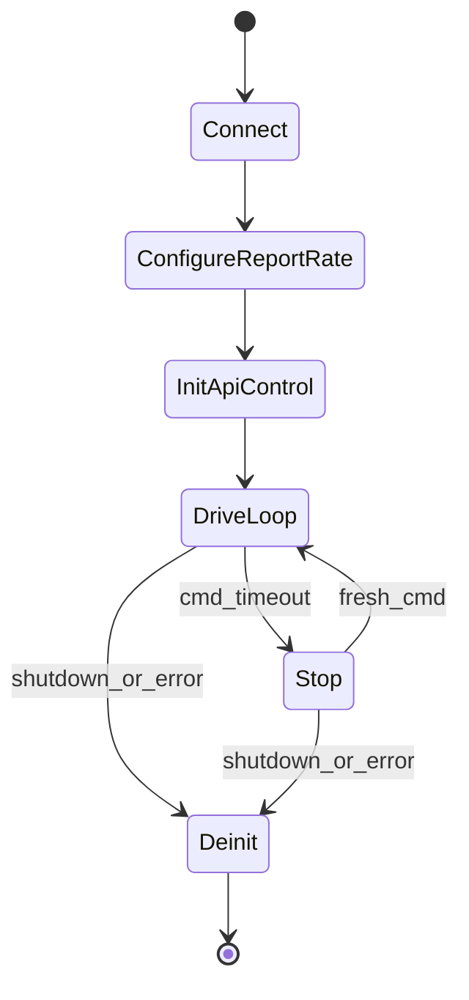

# Hex Ark Navigation Stack Assessment

This document assesses how the ROS 2 Jazzy autonomy stack can be adapted from the original mecanum-wheel T-Bot platform to a Hex Ark two-wheel base with a Livox Mid-360 lidar, a standard webcam, and an NVIDIA AGX Orin.

## Executive Summary

The planner stack is feasible for Hex Ark after moderate integration work. The global planners, terrain mapping, SLAM, waypoint following, and local collision checking can largely stay intact. The main adaptation is below the planner boundary:

- Run the local planner in standard-wheel mode, not mecanum mode.
- Disable the upstream serial motor-controller path.
- Add a ROS 2 bridge that converts `/cmd_vel` into Hex Base WebSocket API commands.
- Tune footprint, speed, yaw-rate, acceleration, obstacle inflation, and stopping distances conservatively for a two-wheel base.

The core navigation stack does not require the webcam. The webcam can be added later for perception, teleoperation, recording, or AI extensions.

## System Flow



## Topic Contract

### Real Robot Route Planner Pipeline

| Stage | Node / package | Subscribes | Publishes | Notes |
|---|---|---|---|---|
| Lidar driver | `livox_ros_driver2` | Mid-360 UDP packets | `/lidar/scan`, `/imu/data` | `MID360_config.json` sets host IP, lidar IP, and Livox ports. |
| SLAM feature extraction | `arise_slam_mid360/feature_extraction_node` | `/lidar/scan`, `/imu/data` | feature clouds used internally by SLAM | Topics come from `livox_mid360.yaml`. |
| SLAM mapping / odometry | `arise_slam_mid360/laser_mapping_node`, `imu_preintegration_node` | SLAM feature clouds, `/imu/data` | `/state_estimation`, `/state_estimation_at_scan`, `/registered_scan` | This is the pose source used by local, route, and exploration planners. |
| Terrain analysis | `terrain_analysis/terrainAnalysis` | `/registered_scan`, `/state_estimation` in code path | `/terrain_map`, obstacle/terrain derived clouds | Local traversability map around the vehicle. |
| Extended terrain analysis | `terrain_analysis_ext/terrainAnalysisExt` | `/terrain_map` | `/terrain_map_ext` | Long-range / extended terrain map consumed by FAR and TARE. |
| Sensor scan generation | `sensor_scan_generation/sensorScanGeneration` | terrain/scan data in package internals | derived scan products | Kept in the real robot launch as part of base autonomy. |
| Route planner | `far_planner/far_planner` | `/state_estimation`, `/terrain_map_ext`, `/terrain_map`, `/registered_scan` | route/graph outputs, goal guidance into the waypoint pipeline | Launch remaps `/odom_world -> /state_estimation`, `/terrain_cloud -> /terrain_map_ext`, `/scan_cloud -> /terrain_map`, `/terrain_local_cloud -> /registered_scan`. |
| Exploration planner | `tare_planner/tare_planner_node` | `/terrain_map`, `/terrain_map_ext`, `/state_estimation_at_scan`, `/registered_scan`, `/navigation_boundary`, `/joy` | `/way_point`, `exploration_finish`, `/runtime` | Uses Mid-360 maps and odometry, not the webcam. |
| RViz waypoint tools | `waypoint_rviz_plugin`, `goalpoint_rviz_plugin` | `/state_estimation` | `/way_point`, `/goal_point`, `/joy` | Interactive operator inputs. |
| Local planner | `local_planner/localPlanner` | `/state_estimation`, `/registered_scan`, `/terrain_map`, `/joy`, `/way_point`, `/speed`, `/navigation_boundary`, `/added_obstacles`, `/check_obstacle` | `/path`, `/slow_down`, `/surrounding_block`, `/free_paths` | Selects collision-free local path candidates. |
| Path follower | `local_planner/pathFollower` | `/state_estimation`, `/path`, `/joy`, `/speed`, `/stop`, `/slow_down`, `/surrounding_block` | `/cmd_vel` | Also writes to `/dev/ttyACM0` when `realRobot=true`; this should not be used for Hex Ark. |
| Hex bridge | `hex_base_bridge` to add | `/cmd_vel` | Hex Base WebSocket command stream, optional `/hex_base/status`, optional `/hex_base/odom` | New integration point for Ark. |

### Command Semantics

The upstream `pathFollower` publishes `geometry_msgs/msg/TwistStamped` on `/cmd_vel`:

| Field | Mecanum meaning | Hex Ark usage |
|---|---|---|
| `twist.linear.x` | forward/back speed | use as Ark forward speed |
| `twist.linear.y` | lateral speed | clamp to `0.0` |
| `twist.angular.z` | yaw rate | use as Ark yaw rate |

In `standard` or `hex_ark_standard` mode, normal path following should already avoid lateral command generation because `omniDirGoalThre` is negative.

## Ark Local Planner Configuration

Use the new configuration file:

```bash
ros2 launch local_planner local_planner.launch config:=hex_ark_standard
```

The file `src/base_autonomy/local_planner/config/hex_ark_standard.yaml` is intentionally conservative:

| Parameter | Starting value | Rationale |
|---|---:|---|
| `localPlanner.omniDirGoalThre` | `-1.0` | Disables omnidirectional goal behavior. |
| `pathFollower.omniDirGoalThre` | `-1.0` | Keeps normal path tracking to forward/back + yaw. |
| `yawRateGain` | `4.0` | Lower than upstream standard-wheel profile for safer first tests. |
| `stopYawRateGain` | `6.0` | Enough heading correction at low speed without aggressive spins. |
| `maxYawRate` | `60.0 deg/s` | Conservative yaw rate for indoor bring-up. |
| `dirDiffThre` | `0.12 rad` | Requires heading alignment before advancing. |
| `stopDisThre` | `0.20 m` | Slightly larger stop radius for safer goal approach. |

The following parameters remain in `local_planner.launch` and must be tuned from the physical Ark platform:

| Launch parameter | Current upstream value | Ark recommendation |
|---|---:|---|
| `vehicleLength` | `0.4 m` | Set to measured full footprint length plus margin. |
| `vehicleWidth` | `0.4 m` | Set to measured full footprint width plus margin. |
| `vehicleWidthMargin` | `0.1 m` | Start at `0.15-0.25 m` indoors until obstacle clearance is proven. |
| `sensorOffsetX` | launch argument | Set from Ark center of rotation to Mid-360 frame. |
| `sensorOffsetY` | launch argument | Set from Ark centerline to Mid-360 frame. |
| `cameraOffsetZ` | launch argument | Only affects `/sensor -> /camera`; not needed for core navigation. |
| `maxSpeed` | `0.875 m/s` | Start around `0.25-0.35 m/s`; raise gradually. |
| `autonomySpeed` | `0.875 m/s` | Start around `0.20-0.30 m/s`. |
| `maxAccel` | `2.0 m/s^2` | Start lower if Ark firmware does not smooth commands. |
| `lookAheadDis` | `0.5 m` | Start with `0.4-0.6 m`; tune for cornering. |
| `slowDwnDisThre` | `0.875 m` | Increase if the base overshoots goals. |
| `obstacleHeightThre` | `0.05 m` | Tune by environment; lower for indoor low obstacles. |
| `minRelZ` / `maxRelZ` | `-0.4 / 0.3` | Adjust for Mid-360 mounting height and Ark body occlusion. |

### Required Launch Change

The upstream real robot launch files include `local_planner.launch` without passing `config`, so they default to `omniDir`.

For Ark, pass:

```python
launch_arguments={
  'config': 'hex_ark_standard',
  'realRobot': 'false',
  'maxSpeed': '0.30',
  'autonomySpeed': '0.25',
  'twoWayDrive': 'true',
  'sensorOffsetX': sensorOffsetX,
  'sensorOffsetY': sensorOffsetY,
  'cameraOffsetZ': cameraOffsetZ,
  'goalX': vehicleX,
  'goalY': vehicleY,
}.items()
```

Use `realRobot=false` so `pathFollower` does not write the upstream serial protocol to `/dev/ttyACM0`. The new Hex bridge should be the only real base actuator.

## Hex Base Bridge Design

Add a ROS 2 package named `hex_base_bridge` or equivalent.

### Inputs

| Topic / source | Type | Required | Purpose |
|---|---|---|---|
| `/cmd_vel` | `geometry_msgs/msg/TwistStamped` | yes | Planner velocity command. |
| `robot_host` parameter | string | yes | Hex Ark IP or IPv6 host. |
| `robot_port` parameter | int | yes | Hex WebSocket port, usually `8439`. |
| safety parameters | doubles | yes | Velocity clamps and timeout. |

### Outputs

| Output | Type | Purpose |
|---|---|---|
| Hex WebSocket `APIDown.BaseCommand.ApiControlInitialize(true)` | protobuf binary | Acquire API control. |
| Hex WebSocket `APIDown.BaseCommand.SimpleMoveCommand(XyzSpeed)` | protobuf binary | Send drive command. |
| Hex WebSocket `APIDown.BaseCommand.ApiControlInitialize(false)` | protobuf binary | Release API control on shutdown. |
| `/hex_base/status` | optional diagnostic message | Expose connection, session holder, battery, warning. |
| `/hex_base/odom` | optional `nav_msgs/msg/Odometry` | Expose base odometry for debugging; do not replace SLAM feedback unless validated. |

### Command Mapping

| ROS command | Hex command |
|---|---|
| `cmd.twist.linear.x` | `XyzSpeed.speed_x` |
| `cmd.twist.linear.y` | clamp, ignore, or require near zero; send `0.0` |
| `cmd.twist.angular.z` | `XyzSpeed.speed_z` |
| n/a | `XyzSpeed.speed_y = 0.0` |

### Safety Behavior

The bridge should enforce:

- Reject or clamp nonzero lateral command: `abs(linear.y) > 0.02` should warn and send `speed_y=0`.
- Clamp forward speed to the Ark bring-up limit, initially `0.30 m/s`.
- Clamp yaw rate to the Ark bring-up limit, initially `0.6-0.8 rad/s`.
- Send at a fixed rate, e.g. 50 Hz, even if `/cmd_vel` is slower.
- If `/cmd_vel` is stale for more than `0.25 s`, send zero velocity.
- On SIGINT, disconnect, WebSocket error, or ROS shutdown, send zero velocity and `ApiControlInitialize(false)`.
- Do not command the base unless WebSocket protocol major/minor compatibility is acceptable.
- Refuse to drive when Hex status reports warnings or a non-clearable parking stop, unless explicitly overridden during testing.

### Lifecycle



## Sensor And Hardware Notes

### Mid-360

The stack already targets Mid-360:

- Driver launch: `src/utilities/livox_ros_driver2/launch_ROS2/msg_MID360_launch.py`
- Driver config: `src/utilities/livox_ros_driver2/config/MID360_config.json`
- SLAM config: `src/slam/arise_slam_mid360/config/livox_mid360.yaml`

Bring-up requirements:

- AGX Orin Ethernet IP must match `host_net_info`, currently `192.168.1.5`.
- Lidar IP must match the serial-number-derived Mid-360 IP in `lidar_configs`.
- Topics expected by SLAM are `/lidar/scan` and `/imu/data`.
- Update blind zones in `livox_mid360.yaml` if Ark body, camera mount, or wiring appears in the Mid-360 field of view.

### Webcam

The core navigation pipeline does not use the webcam. If needed later:

- Publish `/camera/image/compressed` for base-station streaming.
- Publish calibrated camera info if used by AI perception.
- Keep camera mounting out of the Mid-360 field of view or update lidar blind zones.

### AGX Orin

AGX Orin is an appropriate target for:

- ROS 2 Jazzy on Ubuntu 24.04
- Mid-360 driver and SLAM
- Terrain analysis
- Local planner
- FAR route planner

For TARE exploration planner, verify ARM-compatible OR-Tools binaries as described in the upstream README.

## Staged Validation Checklist

### Stage 0: Static Configuration

- Confirm Ark footprint: length, width, sensor offset, Mid-360 height, camera mount height.
- Confirm Hex base max safe `speed_x` and `speed_z`.
- Set Mid-360 host/lidar IPs.
- Launch local planner with `config:=hex_ark_standard` and `realRobot:=false`.

### Stage 1: Sensor Bring-Up

- Start `livox_ros_driver2`.
- Confirm `/lidar/scan` rate and point count.
- Confirm `/imu/data` rate and timestamps.
- Move the base by hand and verify point cloud orientation.

### Stage 2: SLAM Only

- Start `arise_slam_mid360`.
- Confirm `/state_estimation`.
- Confirm `/state_estimation_at_scan`.
- Confirm `/registered_scan`.
- Check for lidar/IMU synchronization warnings.
- Validate map frame stability during slow manual motion.

### Stage 3: Terrain Mapping

- Start `terrain_analysis` and `terrain_analysis_ext`.
- Confirm `/terrain_map` and `/terrain_map_ext`.
- Place low obstacles and verify they appear in the local map.
- Tune `obstacleHeightThre`, `minRelZ`, `maxRelZ`, and blind zones.

### Stage 4: Planner Dry Run

- Start local planner and path follower with `realRobot=false`.
- Publish a nearby `/way_point`.
- Confirm `/path` updates.
- Confirm `/cmd_vel` contains `linear.x` and `angular.z`.
- Confirm `linear.y` is zero or near zero in standard mode.

### Stage 5: Hex Bridge Bench Test

- Run `hex_base_bridge` without wheels on the ground or with a safe lift fixture.
- Confirm API control initializes.
- Send zero command and verify no movement.
- Send tiny forward and yaw commands with strict clamps.
- Confirm timeout sends zero velocity.
- Confirm shutdown releases API control.

### Stage 6: Slow Manual / Smart Joystick

- Put the robot on the ground in open space.
- Use very low `maxSpeed` and yaw clamp.
- Test manual stop, timeout stop, and parking stop.
- Validate command sign conventions for forward and yaw.

### Stage 7: Waypoint Mode

- Send a waypoint within `1-2 m`.
- Confirm local planner avoids visible obstacles.
- Tune `lookAheadDis`, `stopDisThre`, `slowDwnDisThre`, and yaw gains.
- Repeat in corridors and tight turns.

### Stage 8: Route Planner

- Launch `system_real_robot_with_route_planner.launch` equivalent with Ark config.
- Use RViz `Goalpoint`.
- Confirm FAR planner updates visibility graph.
- Confirm local planner receives and follows waypoints.

### Stage 9: Exploration Planner

- Verify OR-Tools on ARM.
- Launch TARE with `indoor_small` first.
- Use a bounded exploration area.
- Confirm `/way_point` output and safe local following.

## Open Measurements Needed

Before real driving, measure and record:

- Ark full footprint length and width.
- Mid-360 offset from the Ark center of rotation.
- Mid-360 mounting height and pitch.
- Hex firmware maximum safe linear and angular velocities.
- Minimum reliable stopping distance at `0.25 m/s` and `0.35 m/s`.
- Whether Ark can safely drive backward in autonomous mode; if not, set `twoWayDrive=false`.
