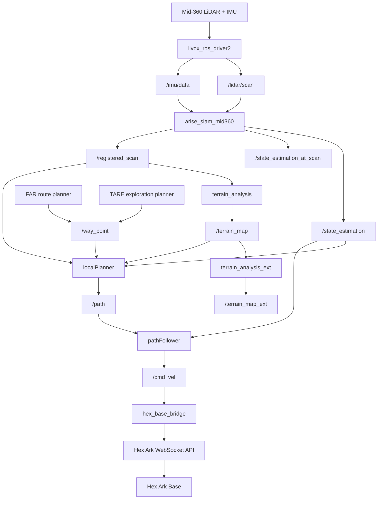
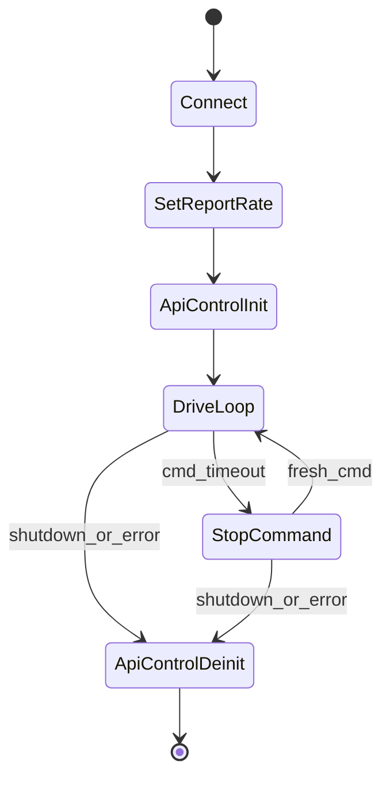

# Hex Ark 室内导航技术流程说明

本文档说明如何将本仓库的 ROS 2 Jazzy navigation stack 部署到 Hex Ark 双轮底盘，并用于室内环境测试。目标硬件配置为：

- 底盘：Hex Ark，双轮/差速类运动模型
- 主机：NVIDIA Jetson AGX Orin
- 激光雷达：Livox Mid-360
- 摄像头：普通 webcam，可选，不参与第一阶段导航闭环

结论先行：这套 navigation stack 可以作为 Hex Ark 的室内自动导航基础使用。仓库已经包含 Mid-360 驱动、LiDAR-IMU SLAM、terrain map、局部避障、waypoint follower、route planner 和 exploration planner。Hex Ark 适配的核心工作不是重写 planner，而是补齐底盘控制桥接层，并把 local planner 切换到标准轮/非全向模式。

## 1. 系统能力边界

本仓库原生提供：

- Mid-360 数据接入：`livox_ros_driver2`
- 主 odom / state estimation：`arise_slam_mid360`
- 点云配准输出：`/registered_scan`
- 地形/障碍物分析：`terrain_analysis`、`terrain_analysis_ext`
- 局部路径选择与避障：`local_planner`
- 路径跟踪与速度命令输出：`pathFollower`
- 全局路线规划：`far_planner`
- 探索规划：`tare_planner`
- RViz waypoint / goalpoint / teleop 交互工具

需要为 Hex Ark 新增或适配：

- `/cmd_vel` 到 Hex Base WebSocket API 的桥接节点
- Ark 专用 local planner 配置
- Ark 尺寸、传感器外参、速度/角速度/加速度限制
- 安全超时、停车保护、API control 生命周期管理

第一阶段不建议依赖 webcam。Webcam 可用于远程监控、AI 感知或数据记录，但当前核心导航链路主要依赖 Mid-360 点云和 IMU。

## 2. 总体数据流



## 3. 原生 odom 来源：arise_slam_mid360

`arise_slam_mid360` 是仓库自带的 Mid-360 LiDAR-IMU SLAM 模块。它不是 FAST-LIO2，但承担类似职责：从 Mid-360 点云和 IMU 估计机器人状态，并为后续 planner 提供统一接口。

关键输出：

| Topic | 用途 |
|---|---|
| `/state_estimation` | 主位姿/odom，local planner、route planner、RViz 工具使用 |
| `/state_estimation_at_scan` | scan 时刻对齐的位姿，exploration planner 使用 |
| `/registered_scan` | 配准后的局部点云，terrain analysis 和 planner 使用 |

因此，在第一阶段，Hex Ark 不需要先接入 FAST-LIO2 才能测试导航。推荐先用 `arise_slam_mid360` 跑通完整闭环。如果在室内场景发现漂移、退化或重定位能力不足，再评估 FAST-LIO2、wheel odom 融合和地图重定位。

## 4. Real Robot Route Planner Topic Contract

| 阶段 | 节点 / 包 | 输入 | 输出 | Hex Ark 适配说明 |
|---|---|---|---|---|
| Mid-360 驱动 | `livox_ros_driver2` | Mid-360 UDP 数据 | `/lidar/scan`, `/imu/data` | 保持原生驱动。配置 Orin IP 和雷达 IP。 |
| SLAM 特征提取 | `arise_slam_mid360/feature_extraction_node` | `/lidar/scan`, `/imu/data` | SLAM 内部特征点云 | 不需要改 planner。需要检查 Mid-360 外参和盲区。 |
| SLAM 建图/里程计 | `arise_slam_mid360/laser_mapping_node`, `imu_preintegration_node` | 特征点云, `/imu/data` | `/state_estimation`, `/state_estimation_at_scan`, `/registered_scan` | 第一阶段主 odom 来源。 |
| 地形分析 | `terrain_analysis/terrainAnalysis` | `/registered_scan`, `/state_estimation` | `/terrain_map` | 用于局部障碍和可通行区域。 |
| 扩展地形图 | `terrain_analysis_ext/terrainAnalysisExt` | `/terrain_map` | `/terrain_map_ext` | FAR/TARE 使用的扩展地图。 |
| Route planner | `far_planner/far_planner` | `/state_estimation`, `/terrain_map_ext`, `/terrain_map`, `/registered_scan` | 全局图、路径/目标引导 | 可以复用，不直接关心底盘是否 mecanum。 |
| Exploration planner | `tare_planner/tare_planner_node` | `/terrain_map`, `/terrain_map_ext`, `/state_estimation_at_scan`, `/registered_scan`, `/navigation_boundary`, `/joy` | `/way_point`, `exploration_finish`, `/runtime` | 后期再测，先验证 waypoint 和 route planner。 |
| 局部路径选择 | `local_planner/localPlanner` | `/state_estimation`, `/registered_scan`, `/terrain_map`, `/joy`, `/way_point`, `/speed`, `/navigation_boundary`, `/added_obstacles`, `/check_obstacle` | `/path`, `/slow_down`, `/surrounding_block`, `/free_paths` | 必须使用非全向配置。 |
| 路径跟踪 | `local_planner/pathFollower` | `/state_estimation`, `/path`, `/joy`, `/speed`, `/stop`, `/slow_down`, `/surrounding_block` | `/cmd_vel` | 保留 `/cmd_vel` 输出，禁用原串口电机输出。 |
| Hex bridge | `hex_base_bridge` | `/cmd_vel` | Hex WebSocket `SimpleMoveCommand` | 新增。负责底盘 API control 和安全钳制。 |

## 5. Hex Ark 底盘适配关键点

### 5.1 禁用 mecanum / omni 行为

仓库默认 `local_planner.launch` 的 `config` 是 `omniDir`，适合 mecanum 轮。Hex Ark 是双轮底盘，不能横移，因此要使用标准轮配置。

已新增起始配置：

```text
src/base_autonomy/local_planner/config/hex_ark_standard.yaml
```

核心参数：

```yaml
localPlanner:
  ros__parameters:
    omniDirGoalThre: -1.0

pathFollower:
  ros__parameters:
    omniDirGoalThre: -1.0
    yawRateGain: 4.0
    stopYawRateGain: 6.0
    maxYawRate: 60.0
    dirDiffThre: 0.12
    stopDisThre: 0.20
```

`omniDirGoalThre < 0` 会让 path follower 避免正常路径跟踪中的横向速度命令。Hex bridge 仍应强制把 `linear.y` 钳制为 `0`，作为安全兜底。

### 5.2 禁用原串口电机控制

原平台真车控制路径在 `pathFollower.cpp` 里：

```text
/cmd_vel 发布后，如果 realRobot=true，则同时写 /dev/ttyACM0
写入内容为三个 float：linear.x, linear.y, angular.z
```

这不是 Hex Ark 的协议。Hex Ark 应使用 WebSocket API，因此：

- `pathFollower` 继续发布 `/cmd_vel`
- 启动时设置 `realRobot=false`
- 新增 `hex_base_bridge` 作为唯一真实底盘执行器

### 5.3 ROS cmd_vel 到 Hex API 的映射

| ROS `/cmd_vel` | Hex Ark API |
|---|---|
| `twist.linear.x` | `XyzSpeed.speed_x` |
| `twist.linear.y` | 忽略/钳制为 `0.0` |
| `twist.angular.z` | `XyzSpeed.speed_z` |
| 无 | `XyzSpeed.speed_y = 0.0` |

Hex command：

```text
APIDown.BaseCommand.SimpleMoveCommand.XyzSpeed {
  speed_x: cmd_vel.linear.x
  speed_y: 0.0
  speed_z: cmd_vel.angular.z
}
```

## 6. Hex Base Bridge 技术规格

建议新增 ROS 2 package：`hex_base_bridge`。

### 6.1 输入

| 输入 | 类型 | 用途 |
|---|---|---|
| `/cmd_vel` | `geometry_msgs/msg/TwistStamped` | planner 输出速度命令 |
| `robot_host` | parameter string | Hex Ark IP 或 IPv6 host |
| `robot_port` | parameter int | Hex WebSocket 端口，通常 `8439` |
| `max_linear_speed` | parameter double | 前后速度上限 |
| `max_yaw_rate` | parameter double | 角速度上限 |
| `cmd_timeout` | parameter double | 命令超时停车 |

### 6.2 输出

| 输出 | 用途 |
|---|---|
| Hex WebSocket binary protobuf | 下发 `APIDown` |
| `/hex_base/status` 可选 | 连接状态、电池、session holder、warning |
| `/hex_base/odom` 可选 | Hex Ark 自身 estimated odometry，仅用于调试或后续融合 |

### 6.3 生命周期



### 6.4 安全策略

Bridge 必须实现：

- `linear.x` 限幅，第一阶段建议 `0.25-0.30 m/s`
- `angular.z` 限幅，第一阶段建议 `0.6-0.8 rad/s`
- `linear.y` 强制为 `0.0`
- `/cmd_vel` 超过 `0.25 s` 没更新，发送零速度
- WebSocket 断开，发送零速度并释放 API control
- ROS shutdown / SIGINT 时发送零速度并 `ApiControlInitialize(false)`
- 如果 Hex status 报 warning、parking stop 或 session holder 异常，默认拒绝继续驱动
- 固定频率重发命令，建议 `50 Hz`

## 7. Ark 专用 Launch 建议

建议不要直接改原始 `system_real_robot.launch`，而是新增 Ark 专用 launch，例如：

```text
src/base_autonomy/vehicle_simulator/launch/system_real_robot_hex_ark.launch
src/base_autonomy/vehicle_simulator/launch/system_real_robot_hex_ark_with_route_planner.launch
```

核心差异：

```python
start_local_planner = IncludeLaunchDescription(
  FrontendLaunchDescriptionSource(os.path.join(
    get_package_share_directory('local_planner'), 'launch', 'local_planner.launch')
  ),
  launch_arguments={
    'config': 'hex_ark_standard',
    'realRobot': 'false',
    'maxSpeed': '0.30',
    'autonomySpeed': '0.25',
    'twoWayDrive': 'true',
    'sensorOffsetX': sensorOffsetX,
    'sensorOffsetY': sensorOffsetY,
    'cameraOffsetZ': cameraOffsetZ,
    'goalX': vehicleX,
    'goalY': vehicleY,
  }.items()
)
```

然后再启动：

```text
hex_base_bridge
```

完整执行路径：

```text
pathFollower -> /cmd_vel -> hex_base_bridge -> Hex Ark WebSocket -> Ark base
```

## 8. Mid-360 配置流程

### 8.1 网络配置

默认配置中 Orin 主机 IP：

```text
192.168.1.5
```

配置文件：

```text
src/utilities/livox_ros_driver2/config/MID360_config.json
```

需要确认：

- Orin 以太网口 IP 与 `host_net_info` 一致
- Mid-360 IP 与 `lidar_configs[].ip` 一致
- 雷达可 ping 通
- 点云 topic 正常发布

### 8.2 SLAM 配置

配置文件：

```text
src/slam/arise_slam_mid360/config/livox_mid360.yaml
```

关键 topic：

```yaml
imu_topic: "/imu/data"
laser_topic: "/lidar/scan"
```

需要检查：

- Mid-360 安装 pitch / roll
- `blindFront`, `blindBack`, `blindLeft`, `blindRight`
- webcam、支架、线缆是否进入雷达视野
- `/state_estimation` 是否稳定
- `/registered_scan` 是否跟随机器人运动正确配准

## 9. Webcam 使用策略

第一阶段无需 webcam 参与导航闭环。

可选用途：

- 远程视频监控
- 数据采集
- AI 视觉识别
- base station 传输 `/camera/image/compressed`

如果安装 webcam 影响 Mid-360 视野，需要更新 `livox_mid360.yaml` 中的 blind zone。

## 10. FAST-LIO2 与原生 SLAM 的取舍

当前建议：

```text
第一阶段：直接使用 arise_slam_mid360
第二阶段：如果漂移或退化明显，再评估 FAST-LIO2
第三阶段：需要持久地图重定位时，再做 localization / map alignment
```

原因：

- `arise_slam_mid360` 已经和本仓库 topic 对齐
- route planner、local planner、terrain analysis 都默认消费它的输出
- FAST-LIO2 需要额外 adapter，把输出转成 `/state_estimation`、`/state_estimation_at_scan`、`/registered_scan`
- 地图重定位和轮速融合不是 FAST-LIO2 原生完整解决的问题，需要额外工程

后续如果接入 FAST-LIO2，建议架构：

```text
Mid-360 + IMU -> FAST-LIO2 -> adapter -> /state_estimation + /registered_scan
Hex wheel odom -> EKF -> optional fused state
```

轮速融合建议优先使用 `robot_localization` 或独立 EKF，不建议第一阶段直接改 FAST-LIO2 内核。

## 11. 分阶段部署与验证

### Stage 0：静态准备

- 安装 Ubuntu 24.04 + ROS 2 Jazzy
- 编译 Livox-SDK2
- 编译 `livox_ros_driver2`
- 编译 SLAM 依赖：Sophus、Ceres、GTSAM
- 编译本仓库
- 测量 Ark 尺寸、Mid-360 外参、最大安全速度

### Stage 1：Mid-360 Driver

检查：

```bash
ros2 topic list
ros2 topic hz /lidar/scan
ros2 topic hz /imu/data
```

目标：

- `/lidar/scan` 正常
- `/imu/data` 正常
- 时间戳稳定
- 点云方向正确

### Stage 2：SLAM Only

启动 `arise_slam_mid360`。

检查：

```bash
ros2 topic hz /state_estimation
ros2 topic hz /state_estimation_at_scan
ros2 topic hz /registered_scan
```

目标：

- 手推/慢速移动时位姿连续
- 无明显跳变
- RViz 中注册点云稳定

### Stage 3：Terrain Map

启动：

- `terrain_analysis`
- `terrain_analysis_ext`

检查：

```bash
ros2 topic hz /terrain_map
ros2 topic hz /terrain_map_ext
```

目标：

- 低障碍物能进入 terrain map
- 地面不过度误检为障碍
- Ark 自身结构不会被当成障碍

### Stage 4：Local Planner Dry Run

启动 local planner：

```bash
ros2 launch local_planner local_planner.launch \
  config:=hex_ark_standard \
  realRobot:=false \
  maxSpeed:=0.30 \
  autonomySpeed:=0.25
```

发送近距离 waypoint，检查：

```bash
ros2 topic echo /path
ros2 topic echo /cmd_vel
```

目标：

- `/path` 有输出
- `/cmd_vel.linear.x` 和 `/cmd_vel.angular.z` 合理
- `/cmd_vel.linear.y` 为 0 或接近 0

### Stage 5：Hex Bridge 架空测试

在车轮离地或安全支架上测试：

- bridge 连接 Hex Ark WebSocket
- API control 初始化成功
- 发送零速度无运动
- 小速度前进和小角速度旋转方向正确
- 超时自动停车
- 关闭节点释放 API control

### Stage 6：低速落地测试

参数建议：

```text
maxSpeed: 0.20-0.30 m/s
autonomySpeed: 0.20-0.25 m/s
maxYawRate: 0.6-0.8 rad/s
```

测试：

- 手动模式
- smart joystick 模式
- 停车保护
- `/cmd_vel` 超时停车
- 前进/后退/旋转方向

### Stage 7：Waypoint Navigation

从 `1-2 m` 近距离 waypoint 开始。

目标：

- 可以到达目标点
- 遇到障碍物能减速或绕开
- 目标附近不振荡
- 窄通道不频繁左右摆动

主要调参：

- `lookAheadDis`
- `stopDisThre`
- `slowDwnDisThre`
- `yawRateGain`
- `stopYawRateGain`
- `vehicleWidthMargin`

### Stage 8：Route Planner

启动 Ark route planner 版本。

目标：

- RViz Goalpoint 能生成全局路线
- FAR visibility graph 正常增长
- local planner 能消费 route planner 给出的 waypoint
- Hex Ark 低速跟踪稳定

### Stage 9：Exploration Planner

最后再测 TARE exploration。

前置条件：

- waypoint navigation 稳定
- route planner 稳定
- AGX Orin 上 OR-Tools 可用
- 设置 navigation boundary

目标：

- `/way_point` 连续输出
- 探索行为可控
- 遇到 SLAM 漂移时能及时停止和恢复

## 12. 风险与对策

| 风险 | 影响 | 对策 |
|---|---|---|
| SLAM 漂移 | 地图和路径错误 | 先低速测试；必要时评估 FAST-LIO2 / 重定位 |
| Ark 不能横移 | mecanum 路径不可执行 | 使用 `hex_ark_standard`，bridge 强制 `linear.y=0` |
| 原串口控制误触发 | 错误驱动 `/dev/ttyACM0` | `realRobot=false`，只允许 Hex bridge 控制 |
| 速度过高 | 碰撞风险 | 第一阶段 `0.2-0.3 m/s` |
| Mid-360 被车体/相机遮挡 | 地图误检 | 调整安装位置或 blind zone |
| wheel odom 未融合 | 退化场景短时漂移 | 第二阶段引入 Hex odom + EKF |
| 没有地图重定位 | 每次启动需重新建图或初始定位 | 第三阶段做 PCD map localization |

## 13. 最小可跑闭环

第一阶段最小闭环如下：

```text
Mid-360
  -> livox_ros_driver2
  -> arise_slam_mid360
  -> /state_estimation + /registered_scan
  -> terrain_analysis
  -> localPlanner(config=hex_ark_standard)
  -> pathFollower(realRobot=false)
  -> /cmd_vel
  -> hex_base_bridge
  -> Hex Ark WebSocket API
```

这个闭环完成后，即可开始室内低速 waypoint navigation 测试。

## 14. 结论

这套 navigation stack 可以部署到 Hex Ark 上进行 indoor 测试。它已经提供完整的 Mid-360 odom、地形分析、局部避障、waypoint navigation、route planner 和 exploration planner。Hex Ark 适配的关键工程量集中在：

1. 使用标准轮配置代替 mecanum 配置
2. 禁用原串口电机输出
3. 新增 `/cmd_vel` 到 Hex WebSocket API 的 bridge
4. 标定 Ark footprint、Mid-360 外参和低速安全参数
5. 按阶段从 sensor、SLAM、terrain、dry run、bridge 到 waypoint/route/exploration 逐步验证

建议优先目标是：**室内低速 waypoint navigation + collision avoidance**。该目标达成后，再推进 route planner 和 exploration planner。
